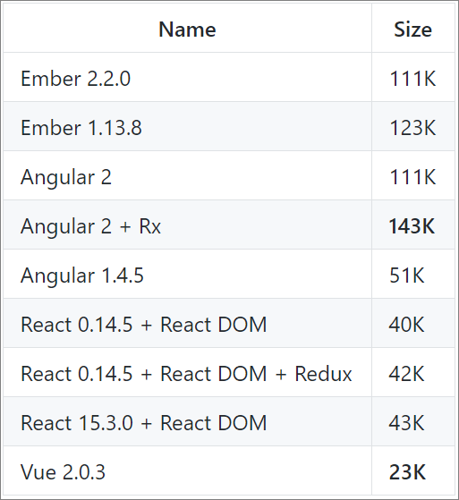
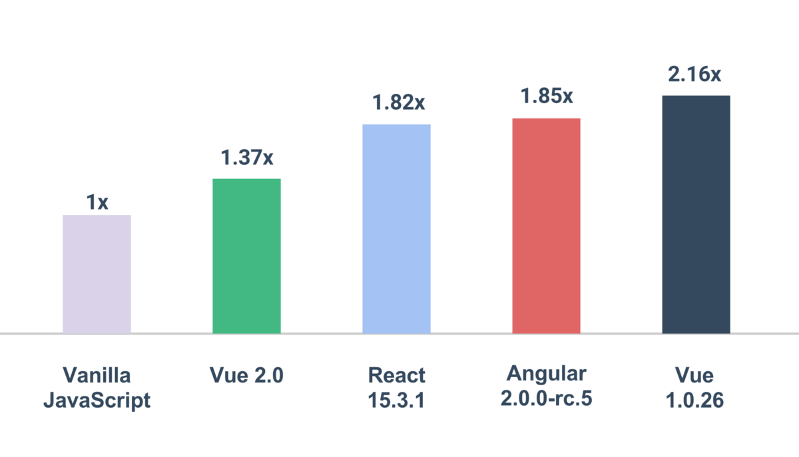
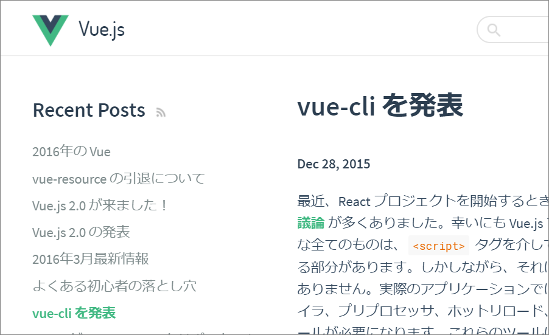

class: center, middle

.col-xs-9[
# Vue.jsへの入り口
2017/06/05  
伊藤貴洋
]

.col-xs-3[
.sm-img[
  
]
]

---
class: middle

.col-xs-6[
## 対象者
- JavaScript初心者から
- jQueryやAngularなら知ってるけど……という人
]

.col-xs-6[

.slide-img[

]

]

---
class:middle

## Vue.js ってなに?

- プログレッシブなJavaScriptフレームワーク
  - AngularやReactとよく比べられる
  - ポイントは、シンプル、リアクティブ、コンポーネント指向

---

# Vue.js は今最も注目されている

- State of JSで利用したいFW2位、期待するFW2位
- github starは以下の通り
  - `AngularJS -> 56000 (2009)`
  - `React -----> 67000 (2013)`
  - `Vue -------> 54000 (2014)`
  - `Angular ---> 24000 (2016)`


---

class: middle

# まず軽い

.col-xs-8[
  .xs-img[
    
  ]
]

---

# そして速い
.col-xs-12[
  .xs-img[
    
  ]
]

---


class: center, middle

# 実際のコーディングと動作

動かしながら見ていきます  
シンプル&リアクティブ

---

# inputのリアルタイム反映

<div id="vue-1">
  <input type="text" v-model="name">
  <div>My name is {{name}}</div>
</div>


.col-xs-6[
```html
<div id="vue-1">
  <input type="text" v-model="name">
  <div>My name is {{name}}</div>
</div>
```
]

.col-xs-6[
```javascript
new Vue({
  el: '#vue-1',
  data: {
    name: "Takahiro",
  },
});
```
]

.center[
`data` = `v-model` = `{{name}}`
]

---


# TODOリスト

<div id="vue-2">
<ul>
  <li v-for="t in todos">
    {{t}} <button @click="del(t)">×</button>
  </li>
</ul>
<input type="text" v-model="newTodo"><button @click="add(newTodo)">＋</button>
</div>

.col-xs-6[
```html
<div id="vue-2">
<ul>
  <li v-for="t in todos">
    <input type="text" v-model="t">
    <button @click="del(t)">x</button>
  </li>
</ul>
<button @click="add">+</button>
</div>
```

- v-forのループ
]

.col-xs-6[
```javascript
new Vue({
  el: '#vue-2',
  data: {
    todos: ['買い物', '掃除'],
    newTodo: ''
  },
  methods: {
    add: function(){
      this.todos.push(this.newTodo);
      this.newTodo = ''
    },
    del: function(data){
      this.todos.$remove(data);},
  },
})
```
]

---

# if分岐

<div id="vue-3">
  偶数/奇数<br>
  <input type="number" v-model="n">
  <div v-if="even">{{n}}は偶数です！</div>
  <div v-else>{{n}}は奇数です！</div>
</div>


.col-xs-6[
```html
<div id="vue-3">
  偶数/奇数<br>
  <input type="number" v-model="n">
  <div v-if="even">{{n}}は偶数です！</div>
  <div v-else>{{n}}は奇数です！</div>
</div>
```
]

.col-xs-6[
```javascript
new Vue({
  el: '#vue-3',
  data: { n: 1 },
  computed: {
    even: function () {
      if(this.n%2===0) {return true};
      return false;
    },
  }
})
```
]

.col-xs-12[
- v-ifの分岐
]

---


<div id="vue-4">
  <div v-html="marked"></div>

  <textarea v-model="md" rows="5">
  </textarea>
</div>


.col-xs-6[
```html
<div id="vue-4">
  <div v-html="marked"></div>

  <textarea v-model="md" rows="5">
  </textarea>
</div>
```
]

.col-xs-6[
```javascript
new Vue({
  el: '#vue-4',
  data: {md: "# Markdown Editor\n- このスライドもMDにて記載\n- Vue × MD = ♡"},
  computed: {
    marked: function () {
      return marked(this.md);
    },
  }
})
```
]

---
class: middle

# 実装が簡単！

---

class: middle

# 他のフレームワークと比べてもそうなの？

---

# 下記を実現するコードで比較

<input type="text" value="Hello, world!">
<div>Hello, world!</div>
<button onclick="alert('Hello, world!')">+</button>
<li>1</li>
<li>2</li>
<li>3</li>

---

# Angular

.col-xs-6[
```html
<input type="text" [(ngModel)]="msg">
<div>{{msg}}</div>
<button (click)="onClick()">+</button>
<li *ngFor="let num of nums">{{num}}</li>
```
]

.col-xs-6[
```javascript
import {Component} from '@angular/core';

@Component({
  selector: 'sample-component',
  templateUrl: './sample.component.html'
})
export class SampleComponent {
  msg: string;
  constructor(){
    this.msg = "Hello, world!";
    this.nums = [1, 2, 3];
  }
  onClick() {
    alert(this.msg);
  }
}

```
]

---

# Vue

.col-xs-6[
```html
<input type="text" v-model="msg">
<div>{{msg}}</div>
<button @click="onClick()">+</button>
<li v-for="num in nums">{{num}}</li>
```
]

.col-xs-6[
```javascript
Vue.component('sample-component', {
  template: './sample.component.html',
  data: function() {
    return {
      msg: = "Hello, world!",
      nums = [1, 2, 3]
    }
  },
  methods: {
    onClick: function(){alert(this.msg)}
  }
})
```
]

---

# React

```javascript
import React from 'react';

var sample-component = React.createClass({

  getInitialState: function(){
    return {
      msg: "Hello, world!",
      nums: [1, 2, 3]
    }
  },

  onClick: function(msg){ alert(msg) },  

  render: function() {
    return (
      <input type="text" value="{this.state.msg}">
      <div>{msg}</div>
      <button onClick="onClick()">+</button>
      <NumList data={this.state.nums} />
      // リストはサブコンポーネントが必要そう
    );
  }
});
```

---

# Vue……！？

```html
<template>
  <input type="text" v-model="msg">
  <div>{{msg}}</div>
  <button @click="onClick()">+</button>
  <li v-for="num in nums">{{num}}</li>
</template>

<script>
module.exports = {
  data: function() {
    return {
      msg: = "Hello, world!",
      nums = [1, 2, 3]
    }
  },
  methods: {
    onClick: function(){alert(this.msg)}
  }
}
</script>

<style>
  <!-- anyCSS -->
</style>
```

---

## Vueは単一ファイルコンポーネントもできる

- HTML, JS, CSSをひとまとめ！
- 単一ファイルが嫌ならこう記述も出来る

```html
<template>
  <div>This will be pre-compiled</div>
</template>
<script src="./my-component.js"></script>
<style src="./my-component.css"></style>
```

---

## ただしWebpack等によるビルドが必要

- 初心者の最大のつまづきポイント
- 設定などが複雑になりがち
- いきなりアプリ本体開発に入りづらい
- Angularならangular-cliがあるのに……

---



---

# vue-cli、あります

- vue-loaderと組み合わせて使う
- webpack, browserify, simpleなどのテンプレ
-  基本的な機能は全部揃っている
  - モジュール化
  - ホットリロード
  - トランスパイラ、プリプロセッサ
  - リント、テストツール

---

## Angularはフルスタックだけど？

- 多様なオフィシャルプラグイン
  - router
  - animations
  - forms
  - http

---

# Router, dev-toolsあります

- SPA作るために必要な機能は全てある
- vue-resource(ajax)は公式推奨から引退
- animationやformsはFWの範囲じゃない？
- 必要なら非公式のvue連携のライブラリはたくさんある！

---

## ReactにはReduxがある

- JS内のデータの流れを整理するアーキテクチャ
- ベースはFacebookの提唱するFlux
- 状態管理はコア機能と統合されているとより良い

.col-xs-12[
  .sm-img[
    
  ]
]

---

## Vuex、あります

.col-xs-12[
  .xs-img[
    
  ]
]

---

## Webアプリ開発のコアは揃っている

- Vue
- Vue Router
- Vuex

---

class: middle

# Vueの弱点

---

class: middle

# ない

---

## 本当に大したものが思い浮かばない

- ネイティブレンダリングも[Weex](https://weex.apache.org/)がある
  - まだ成熟してないからそこは弱点
- 元々はEvan You氏の個人的なサイドPJ
  - 現在はコミュニティベースのVue teamは20名
  - You氏は[Patreonで出資](https://www.patreon.com/evanyou)を募りフルタイムで開発
  - 2017年5月現在 156人(社)から$10,151/月受ける
  - PHPのLaravelにも採用
- サポートもAngularやReactと大して変わらない
  - Forum, Gitter, Github
- 日本ではまだ仕事が少ないくらい？（；ー；）

---

## 採用例も大手で結構ある

.col-xs-6[
- 中国
  - Alibaba
  - Baidu
  - Tencent
  - Xiaomi
  - DJI
]

.col-xs-6[
- 日本
  - LINE
  - 任天堂
- イギリス
  - Sainsbury's
- アメリカ
  - Gitlab
]

---

## プログレッシブなFWという意味

- 小規模から大規模な開発までスケール可能
- 小規模
  - Vue.js + (vue-cli)
- 中規模
  - Vue.js + vue-cli + Vue Router
-  大規模
  - Vue.js + vue-cli + Vue Router + Vuex

---

class: middle

# なんでも出来る = 覚えるのが大変なのでは？

---

## 必要なものは必要な時に覚えればいい

- 自分もVueと出会った当初JS力が低かった
- でもAngularやReactと異なりつまづかない（重要）
- スモールスタートからはじめ大きなアプリへ
- 初心者にこそ使ってほしい

---

## 日本語の情報もたくさん

- そもそも公式ドキュメントが日本語化されている
- Vueのコアチームに日本人が3名いる
- Qiitaにも`vue.js`タグは441投稿もある

---

## まとめ

- 開発者に人気
- 実装しやすい、学習コストが低い
- 軽くて速い
- 公式ライブラリでスケーラブルな開発
- 日本語コミュニティも活発になっている

---

class: middle

# Let's use Vue.js!

ご清聴ありがとうございました。